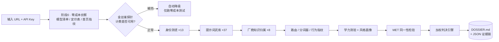

<div align="center">


# 🔍 API Detective

**AI 中转站 API 验真取证工具 —— 让每一分钱都花在真模型上**

*LLM relay API forensics — verify the model behind your API key, extract injected system prompts, and trace the upstream supply chain.*

[](LICENSE)
[](https://www.python.org/)
[](https://github.com/Dragon-01-you/api-detective/stargazers)
[](https://github.com/Dragon-01-you/api-detective/network/members)
[](https://github.com/Dragon-01-you/api-detective/issues)
[]()
[]()

模型验真 · 系统提示词取证 · 上下游供应链溯源

</div>

---

## 🤔 这是个什么项目？（说人话版）

你在网上买了「DeepSeek / GPT / Claude 会员」，商家信誓旦旦说接的是官方原版……

但你有没有想过：**它背后跑的，真的是你付钱买的那个模型吗？**

这就像去金店买金条——标签写着「足金 999」，可你手里没有任何验金工具。市面上的**中转站**（API 转售服务）就是这样一个黑盒：接口里的 `model` 字段写什么全凭商家良心，**一行代码就能伪造**。

**API Detective 就是你口袋里的「验钞机」**：给它一个 URL 和 API Key，它会像侦探一样对目标端点展开多维度行为取证，最后产出一份带评分、带完整证据链、小白也能看懂的《验真报告》。

### 它能回答 5 个问题

| # | 问题 | 怎么回答 |
|:---:|---|---|
| 1 | **这是什么模型？** | 身份测谎 + 思维链泄露 + 提示词提取（不只看 `model` 字段——那个一行代码就能伪造） |
| 2 | **什么水平？** | 多学科 × 多难度学力测验，输出能力档位 |
| 3 | **是不是同一个？** | 同站多渠道 / 中转 vs 官方的模型同一性检验（MET） |
| 4 | **有没有猫腻？** | 内容路由欺诈检测、封口指令检测、假流式检测、经济学可行性测算 |
| 5 | **证据在哪？** | 全部原始 JSON 留档，报告逐条附小白可读解释，可复核、可反驳 |

---

## 📑 目录

- [快速开始](#-快速开始)
- [工作原理](#-工作原理)
- [技术实现](#-采用了哪些技术实现)
- [对比同类项目](#-对比同类项目)
- [实际案例](#-实际案例relay-x-低价包月中转站验真已脱敏)
- [证据输出结构](#-证据输出结构)
- [常见问题](#-faq)
- [路线图](#-路线图)
- [参与贡献](#-参与贡献)
- [使用须知](#-使用须知与免责声明)

---

## 🚀 快速开始

### 环境要求

| 依赖 | 版本 |
|---|---|
| Python | ≥ 3.10 |
| openai / tiktoken / requests | 最新版即可 |
| 一个待验真端点 | 自有 Key 的 OpenAI 兼容 API（形如 `https://xxx/v1`） |

### 三步上手

**① 安装依赖**

```bash
git clone https://github.com/Dragon-01-you/api-detective.git
cd api-detective
pip install -r requirements.txt
```

**② 一键挖掘（推荐）**

URL + API Key → 模型定位 / 上下游关系网 / 系统提示词 / 总档案：

```bash
python -m api_detective dig \
  --base-url https://your-relay.example.com/v1 \
  --api-key sk-xxxx \
  --model deepseek-v4-pro \
  --compare-model kimi-k3 \
  --budget 200 \
  --out ./dossier_evidence
```

**③ 查看报告**

打开 `./dossier_evidence/DOSSIER.md`——结论优先、逐条引用证据，判决评分 0–100。

> 💡 **拿到新的中转站 URL 想复测？** 换掉 `--base-url` 和 `--api-key` 重跑 `dig` 即可。每次运行产出独立证据目录，方便横向对比多个站点的对应关系。

### 分阶段运行（可选）

```bash
python -m api_detective scan --base-url ... --api-key ... --model ...   # 全阶段扫描
python -m api_detective report --evidence ./evidence                   # 仅生成报告
```

各阶段可单独运行，计费调用量详见下表：

| 阶段 | 模块 | 做什么 | 计费调用 |
|---|---|---|---|
| 0 | `recon` | 模型清单/计费表/套餐表/首页框架指纹/多站马甲线索 | 0 |
| canary | `core` | 金丝雀探针：402/计费被挡自动降级 | 1 |
| 1 | `identity` | 随机化多语言身份测谎（防内容路由） | ~13 |
| 2 | `prompt_extract` | 20 种提示词提取技术武库 | ~20 |
| 2b | `pliny` | 对抗性提取武库：NEW_PARADIGM/leetspeak/CCA/Crescendo/CoT 侧信道 | ~17 |
| 2c | `dialect` | 厂商自我知识归属：问"只有自家模型才知道的家事" | ~8 |
| 3 | `router_detect` | 内容路由探测器（A/B + Fisher 精确检验） | ~20 |
| 4 | `tokenizer_probe` | token 计数器指纹（cl100k/o200k 基线比对） | ~5 |
| 5 | `behavior` | 延迟画像 / 假流式 / t=0 确定性 / 错误措辞指纹 | ~15 |
| 6 | `capability` | 全学科学力测验（数学/逻辑/代码/科学/医学/法律/社工） | ~19 |
| 7 | `style` | 情绪/风格 12 维画像 | ~18 |
| 8 | `met` | 模型同一性检验（string-kernel MET 简化实现） | ~48 |
| — | `verdict` | 加权判决引擎 + 小白解释 | 0 |

---

## ⚙️ 工作原理

`dig` 的流程：零成本指纹（错误矩阵 / 特征端点 / 定价表 / 自曝消息 / 姊妹站发现）→ 金丝雀 → 身份测谎 → 提示词武库（含二十问假设确认收网）→ 厂商归属 → MET → 供应链关系网 → `DOSSIER.md`（含全量证据清单）。计费被挡时自动降级并显式标注「证据不完整」。



---

## 🧪 采用了哪些技术实现

<div align="center">

</div>

**技术栈刻意保持极简**：Python 3.10+，仅 3 个运行时依赖（`openai` / `tiktoken` / `requests`），无数据库、无后台服务，所有证据保存在本地目录。

| 技术 | 用途 |
|---|---|
| OpenAI 兼容协议探测 | 统一入口，同时兼容 Anthropic / Gemini 协议探针 |
| **Model Equality Testing**（ICLR 2025, Stanford） | MET 模块理论基础：统计检验两个端点是否同一模型 |
| string-kernel 统计检验 + Fisher 精确检验 | 证明「什么问题给什么假身份」是系统性路由而非随机巧合 |
| token 计数器指纹（cl100k / o200k 基线） | 网关用哪家的分词器计费，暴露真实转售链路 |
| 对抗性提示词工程 | NEW_PARADIGM、CCA 历史伪造、Crescendo 多轮渐进、leetspeak 编码（吸收自社区一线越狱项目并工程化） |
| 金丝雀降级设计 | 先花 1 次调用探测计费可用性，被挡则自动止损，不烧冤枉钱 |
| 加权判决引擎 | 8 类证据各占权重 → 0–100 评分 + 小白解释，每条线索附原始 JSON |

### 判决档位

`正品官方直连/可信转售 (≥85)` → `大体可信 (≥65)` → `可疑 (≥45)` → `高度可疑 (≥25)` → `确证贴牌/拼装 (<25)`

评分不是玄学：每条线索带原始 JSON 留档，可复核、可反驳。

---

## ⚔️ 对比同类项目

系统研究了社区最知名的提示词提取 / 系统提示词档案项目，**吸收精华，补齐盲区**：

| 项目 | 它有的 | 它没有的（我们的差异化） |
|---|---|---|
| [elder-plinius / CL4R1T4S](https://github.com/elder-plinius)（40k★ 级） | NEW_PARADIGM、leetspeak、CCA 等一线越狱技术 | 无验证管线；无中转站威胁模型；无统计检验；无判决引擎 |
| [asgeirtj/system_prompts_leaks](https://github.com/asgeirtj/system_prompts_leaks)（40k★ 级） | 厂商逐字提示词档案 | 其 Issue 自认多数内容是行为重构，缺取证方法学 |
| LLMmap | 黑盒模型家族指纹 | 不做欺诈定性、不给举报级证据链 |
| Real Money, Fake Models（arXiv） | 中转站审计框架论文 | 无开箱即用工具与小白可读判决 |

**我们独有的 6 个杀手锏**：

1. 🎯 **中转站威胁模型** —— 目标不是厂商系统提示词，而是中转层注入的封口/改写指令（贴牌实锤的直接证据）
2. 🧠 **CoT 侧信道收割** —— 诱导模型在思维链里复述指令，再从 reasoning_content 里捞泄露
3. 🥫 **罐头答案聚类** —— 字节级一致的重复回复 = 触发风控话术模板，本身即是证据
4. 🔀 **内容路由 A/B + Fisher 检验** —— 证明「什么问题给什么假身份」是系统性路由
5. 💰 **经济学不可行性测算** —— 远低于官方成本的包月价，只有偷 key / 盗用 / 拼装三种解释
6. ⚖️ **加权判决 + 本地留证** —— 直接产出可用于消费投诉的证据包

### 方法论引用

- **Model Equality Testing**（ICLR 2025, Stanford）—— MET 模块的理论基础
- **Real Money, Fake Models: Deceptive Model Claims in Shadow APIs**（arXiv:2603.01919）—— 中转站审计的整体框架
- **LLMmap** —— 黑盒指纹查询策略

---

## 📖 实际案例：「Relay-X」低价包月中转站验真（已脱敏）

> 应合规要求，本案例隐去站点身份与联系方式，方法与数据特征均来自真实取证。

**背景**：某中转站宣称提供 DeepSeek 全系官方直连，包月价格仅为官方成本的几百分之一。用户持自有 Key 运行 `dig` 一键取证。

<div align="center">

</div>

**取证发现**（节选，全部有 JSON 原始留档）：

| 发现 | 结论类型 |
|---|---|
| 宣称「DeepSeek 官方直连」，但 8 条渠道中 6 条由同一家第三方厂商后端供货 | 贴牌转售实锤 |
| 中文身份问题 100% 被改道至另一型号回答（英文提问则正常），Fisher p<0.001 | 内容路由欺诈 |
| 提取到三层注入的系统提示词模板（英文身份层 + 中文皮肤层 + 思维链指令层），经间隔复测逐字一致 | 封口指令铁证 |
| 同一 SKU 在 60 秒内先后命中两家不同上游厂商（其中一家返回了上游默认欢迎语原文） | 渠道池轮换实锤 |
| 网关按 OpenAI 系分词器计费，与本地 cl100k 基线精确吻合，与「DeepSeek 官方」说法矛盾 | 转售链路暴露 |

**最终判决：33/100「高度可疑（大概率假货）」**。全程消耗不到 $0.05，产出 100+ 份证据文件与一份 `DOSSIER.md` 总档案，可直接用于平台投诉与消费维权。

完整脱敏版复盘见 [`examples/relayx_case.md`](examples/relayx_case.md)。

---

## 📁 证据输出结构

```
dossier_evidence/
├── DOSSIER.md                  # 总档案：结论优先，逐条引用证据
├── _final_results.json         # 结构化结果 + 判决评分
├── recon_summary.json          # 零成本侦察摘要
├── fp_*.json                   # 指纹矩阵（端点/错误措辞/定价表）
├── um_row_*.json               # 各模型身份测谎原始记录
├── um_sysmsg*_*.json           # 系统提示词提取 + 稳定性复核
└── ...                         # 每次探测一个 JSON，全程可复核
```

---

## ❓ FAQ

<details>
<summary><b>会被商家发现吗？</b></summary>
所有请求都是普通对话请求，走标准 `/v1/chat/completions` 接口，不注入恶意载荷、不做压力测试。
</details>

<details>
<summary><b>要花多少钱？</b></summary>
默认预算内通常 $0.02–$0.2。金丝雀阶段发现计费被挡会立即降级为零成本测试，绝不烧冤枉钱。
</details>

<details>
<summary><b>直接问模型"你是谁"不行吗？</b></summary>
不行。`model` 字段和口头自我介绍都是一行代码就能伪造的东西。我们看的是无法伪装的行为侧信道：分词器计数、错误措辞、延迟画像、知识归属、思维链泄露……
</details>

<details>
<summary><b>支持哪些协议？</b></summary>
以 OpenAI 兼容协议为主入口，同时内置 Anthropic Messages 与 Gemini 协议探针，可识别网关的多协议马甲。
</details>

<details>
<summary><b>API Key 安全吗？</b></summary>
Key 仅在本地使用、通过命令行参数传入，不会写入任何代码或配置文件；所有证据仅保存在你本地的 `--out` 目录，工具本身零遥测、零上传。
</details>

---

## 🗺️ 路线图

- [x] 身份测谎 / 提示词武库 / 厂商归属 / MET / 判决引擎
- [x] `dig` 一键模式 → DOSSIER 总档案
- [x] 三层注入模板提取 + 稳定性复测
- [ ] Web UI 报告可视化（本地静态页）
- [ ] 官方 API 基线库自动化同步
- [ ] 多站点横向对比报告
- [ ] 英文文档

---

## 🤝 参与贡献

欢迎通过 Issue 和 PR 参与：

1. Fork 本仓库
2. 创建特性分支：`git checkout -b feature/amazing-feature`
3. 提交更改：`git commit -m "feat: add amazing feature"`
4. 推送分支：`git push origin feature/amazing-feature`
5. 发起 Pull Request

特别欢迎的方向：新的提示词提取技术、官方 API 基线数据、判决引擎权重调优建议、文档翻译。

---

## 🛡️ 使用须知与免责声明

- 仅用于**你自己持有 Key 的端点**的验真，请勿用于攻击他人服务或未授权测试
- 所有证据仅保存在本地 `--out` 目录，工具本身不上传任何数据
- 本项目输出为技术分析意见，不构成法律建议；维权请咨询专业人士
- 请遵守你所在司法辖区的法律法规（中国大陆用户可参考《消费者权益保护法》与 12315 平台流程）

---

## 🌟 Star 历史

如果这个工具帮你省了冤枉钱或避了坑，欢迎点个 Star ⭐ 让更多人看到

[](https://star-history.com/#Dragon-01-you/api-detective&Date)

---

<div align="center">

**API Detective** — LLM relay API forensics toolkit

`AI中转站` · `API验真` · `假模型检测` · `模型指纹` · `系统提示词提取` · `System Prompt Extraction` · `LLM Forensics` · `Model Fingerprinting` · `Model Equality Testing` · `API Gateway Audit` · `大模型安全` · `DeepSeek` · `GPT中转` · `Claude中转`

</div>
