<div align="center">


# 🔍 API Detective

**LLM relay API forensics — make every cent go to the real model**

*[简体中文](README.md) | English*

[](LICENSE)
[](https://www.python.org/)
[](https://github.com/Dragon-01-you/api-detective/actions/workflows/ci.yml)
[](https://github.com/Dragon-01-you/api-detective/stargazers)
[](https://github.com/Dragon-01-you/api-detective/network/members)
[](https://github.com/Dragon-01-you/api-detective/issues)
[]()
[]()

Model verification · System-prompt forensics · Upstream supply-chain tracing

</div>

---

## 🤔 What is this project? (Plain English)

You bought a "DeepSeek / GPT / Claude membership" from an online relay service. The vendor swears it's the official model...

But have you ever wondered: **is the model behind the API actually the one you paid for?**

It's like buying a gold bar — the label says "999 pure gold", but you have no tool to verify it. **LLM relay services** (API resellers) are exactly that black box: whatever the `model` field says is entirely up to the vendor, and **it can be forged with one line of code**.

**API Detective is the "counterfeit detector" in your pocket**: give it a URL and an API key, and it runs multi-dimensional behavioral forensics against the endpoint, then produces a verdict report with a score, a complete evidence chain, and plain-language explanations.

### It answers 5 questions

| # | Question | How |
|:---:|---|---|
| 1 | **Which model is this?** | Identity lie-detection + chain-of-thought leakage + prompt extraction (never trust the `model` field — it's one line of code to fake) |
| 2 | **How capable is it?** | Multi-subject × multi-difficulty academic testing → capability tier |
| 3 | **Are these the same model?** | Model Equality Testing (MET) across channels / relay vs. official |
| 4 | **Any funny business?** | Content-routing fraud, gag-instruction detection, fake-streaming detection, economic-feasibility analysis |
| 5 | **Where's the evidence?** | Every clue archived as raw JSON with layman-readable explanations — auditable, contestable |

---

## 📑 Table of Contents

- [30-second Demo](#-30-second-demo)
- [Public Intelligence Library](#-public-intelligence-library-usable-without-installing)
- [Quick Start](#-quick-start)
- [How It Works](#%EF%B8%8F-how-it-works)
- [Technology](#-technology)
- [New Capabilities in Depth](#-new-capabilities-in-depth-v04)
- [Use as an Agent Skill](#-use-as-an-agent-skill)
- [Local Web UI](#%EF%B8%8F-local-web-ui)
- [Comparison](#%EF%B8%8F-comparison)
- [Real-world Case](#-real-world-case-relay-x-anonymized)
- [Evidence Output](#-evidence-output-structure)
- [FAQ](#-faq)
- [Roadmap](#%EF%B8%8F-roadmap)
- [Contributing](#-contributing)
- [Disclaimer](#%EF%B8%8F-disclaimer)

---

## 🎬 30-second Demo


A condensed replay of a real `dig` run: zero-cost fingerprinting → canary → unmasking (vendor confession matrix, verbatim system-prompt hits) → verdict.

---

## 📡 Public Intelligence Library (usable without installing)

Don't want to install anything? Consume the fraud-pattern intelligence distilled from real forensic cases:

- **[30-second cheat sheet](intel/README.md)** — one table to spot a suspicious relay (fake SKU naming / mixed `owned_by` namespaces / verbatim-identical rebadging … each with detection method and evidence level)
- **[fraud_patterns.json](intel/fraud_patterns.json)** — machine-readable library of 9 fraud-pattern families, ready for risk-control rules or academic citation
- **[Multi-site cross-comparison report](intel/cross_site_comparison.md)** — tactic matrix across three real relay sites + shared bottom-line patterns (incl. the 2026-08 retest: single-backend rebadge confirmed)

> The intel library is pure data (zero deps); `api-detective` is its automated executor. New patterns via PR are welcome.

---

## 🚀 Quick Start

### Requirements

| Dependency | Version |
|---|---|
| Python | ≥ 3.10 |
| openai / tiktoken / requests | core runtime deps (deliberately just three) |
| torch / transformers / scipy / numpy | **optional**: only for the LLMmap pretrained fingerprint (see below) |
| An endpoint to verify | an OpenAI-compatible API with your own key (`https://xxx/v1`) |

### Three steps

**① Install**

```bash
git clone https://github.com/Dragon-01-you/api-detective.git
cd api-detective
pip install -r requirements.txt
```

**② One-shot dig (recommended)**

URL + API key → model identification / upstream relationship graph / system prompts / full dossier:

```bash
python -m api_detective dig \
  --base-url https://your-relay.example.com/v1 \
  --api-key sk-xxxx \
  --model deepseek-v4-pro \
  --compare-model kimi-k3 \
  --baseline deepseek-v4 \
  --budget 200 \
  --out ./dossier_evidence
```

**③ Read the report**

Open `./dossier_evidence/DOSSIER.md` — conclusions first, every claim backed by evidence, verdict score 0–100.

> 💡 **Got a new relay URL to test?** Just swap `--base-url` and `--api-key` and re-run `dig`. Each run writes to its own evidence directory, so you can cross-compare multiple sites.

### Phase-by-phase (optional)

| Phase | Module | What it does | Billed calls |
|---|---|---|---|
| 0 | `recon` | Model catalog (cross-checked against the LLMmap 52-template library) / pricing / homepage fingerprint / sister-site clues | 0 |
| canary | `core` | Canary probe: auto-degrade when billing is blocked | 1 |
| 0.5 | `unmask` | Unmasking: echo matrix / system-message quoting / vendor confession / injection tiers | ~24 |
| 3a | `llmmap` | **LLMmap pretrained fingerprint**: 8 queries × 52 templates nearest-neighbor (optional dep) | 8 |
| 1 | `identity` | Randomized multilingual identity lie-detection (anti content-routing) | ~13 |
| 2 | `prompt_extract` | 20-technique prompt-extraction arsenal | ~20 |
| 2b | `pliny` | Adversarial arsenal: NEW_PARADIGM / leetspeak / CCA / Crescendo / CoT side-channel | ~17 |
| 2c | `dialect` | Vendor self-knowledge attribution | ~8 |
| 3 | `router_detect` | Content-routing detector (A/B + Fisher exact test) | ~20 |
| 4 | `tokenizer_probe` | Token-counter fingerprinting (cl100k/o200k baselines) | ~5 |
| 4b | `crypto_signature` | **Cryptographic signature verification**: Anthropic thinking signature / OpenAI reasoning tokens | ~4 |
| 4c | `security_audit` | **Security audit**: injection / truncation / tool rewriting / SSE / key leakage (isolated query family) | ~12 |
| 5 | `behavior` | Latency profiling / fake streaming / t=0 determinism / error dialect | ~15 |
| 6 | `capability` | Full academic testing (math/logic/code/science/medicine/law/social) | ~19 |
| 7 | `style` | 12-dimension emotion/style profiling | ~18 |
| 8 | `met` | Model Equality Testing (string-kernel MET) | ~48 |
| 6b | `baseline_compare` | **Official baseline comparison**: cosine/KL divergence → FRAUD_DETECTED tiers | 0 |
| — | `verdict` | Verdict engine v2: category normalization + temperature softmax + probabilistic output | 0 |

---

## ⚙️ How It Works

```mermaid
flowchart LR
    A["URL + API Key"] --> B["Phase 0 · zero-cost recon<br/>catalog / pricing / homepage"]
    B --> C{"Canary probe<br/>billing OK?"}
    C -- "blocked" --> D["Auto-degrade<br/>zero-cost tests only"]
    C -- "OK" --> M["LLMmap pretrained fingerprint<br/>8 queries × 52 templates"]
    M --> E["Identity lie-detect ×13"]
    E --> F["Prompt arsenal ×37"]
    F --> G["Vendor attribution ×8"]
    G --> H["Router / tokenizer / behavior"]
    H --> N["Crypto signature + security audit"]
    N --> I["Academic tests + style profile"]
    I --> J["MET identity test"]
    J --> O["Official baseline comparison<br/>(optional --baseline)"]
    O --> K["Verdict engine v2<br/>category norm + softmax"]
    K --> L[("DOSSIER.md<br/>+ JSON evidence chain")]
```



### Verdict tiers

`Genuine/credible reseller (≥85)` → `Mostly credible (≥65)` → `Suspicious (≥45)` → `Highly suspicious (≥25)` → `Confirmed rebadged (<25)` → `Inconclusive (coverage <35% triggers a protective tier)`

The score is not guesswork: 11 evidence categories with explicit weights, every clue backed by raw JSON. The v2 engine additionally outputs a **P(genuine) probability** (softmax-calibrated, temperature 0.5) and an **evidence-coverage ratio** — no more high scores from half-run probes.

---

## 🧪 Technology

<div align="center">

</div>

Deliberately minimal stack: Python 3.10+, three core runtime dependencies (`openai` / `tiktoken` / `requests`), no database, no backend — all evidence stays local. Heavy deps (torch) are optional installs; their probes degrade gracefully when absent.

| Technique | Purpose |
|---|---|
| OpenAI-compatible protocol probing | Single entry point; also probes Anthropic / Gemini protocol masks |
| **LLMmap pretrained fingerprint** (USENIX Security '25) | 8 queries × 52-model siamese network → distance-ranked nearest neighbors, no official baseline needed |
| **Cryptographic signature verification** | Anthropic thinking signature (server-side crypto, unforgeable by relays) + OpenAI reasoning-token difficulty discrimination |
| **Model Equality Testing** (ICLR 2025, Stanford) | Theoretical basis of the MET module |
| String-kernel statistics + Fisher exact test | Proves "which question gets which fake identity" is systematic routing, not chance |
| Token-counter fingerprinting (cl100k / o200k) | Whose tokenizer bills you = whose gateway resells to you |
| **Official baseline comparison** (cosine similarity / KL divergence) | Target features vs official baselines → FRAUD_DETECTED / SUSPICIOUS / INCONCLUSIVE / MATCH |
| **Security audit** (isolated query family) | Prompt injection / context truncation / tool-call rewriting / SSE integrity / key leakage |
| Adversarial prompt engineering | NEW_PARADIGM, CCA history forgery, Crescendo, leetspeak (absorbed from top community projects, engineered into a pipeline) |
| Canary degradation | One billed call to detect blocked billing, then auto-stop — never waste money |
| **Verdict engine v2** (category normalization + temperature softmax) | 11 evidence categories → normalized → probabilistic P(genuine) → 0–100 score; failed probes skipped automatically |

---

## 🧬 New Capabilities in Depth (v0.4)

### 1. LLMmap Pretrained Fingerprint (fast pre-classification layer)

Integrates the pretrained siamese network of [pasquini-dario/LLMmap](https://github.com/pasquini-dario/LLMmap) (MIT, USENIX Security '25): 8 carefully designed queries hit the target endpoint; responses are matched against 52 official behavioral templates, producing a distance-ranked list:

```
[Distance: 32.95] --> LiquidAI/LFM2-1.2B <--
[Distance: 40.79]     microsoft/Phi-3-mini-128k-instruct
[Distance: 43.67]     Qwen/Qwen2-1.5B-Instruct
```

- **Position**: before identity — narrow candidates first, verify precisely with live probes
- **Verdict weight**: 0.14 (pretrained-model output ranks above live probes)
- **Extend with new models**: `python -m api_detective add-model <model_name>` (reuses LLMmap's template-extension flow, no retraining)
- **recon integration**: the 52-model list cross-checks the relay's catalog at zero cost

Enable (optional dependencies):

```bash
pip install -r requirements-llmmap.txt        # torch/transformers/scipy/numpy
git clone https://github.com/pasquini-dario/LLMmap
export LLMMAP_MODEL_PATH=./LLMmap/data/pretrained_models/default
```

### 2. Cryptographic Signature Verification (highest-weight evidence)

Behavioral side channels can be imitated; **cryptographic evidence cannot**:

- **Anthropic thinking signature**: the encrypted signature returned by the official server in extended-thinking mode (Base64). We check existence + length + charset + **cross-call distinctness** (real signatures differ every call; forged ones repeat). Claiming Claude but failing this = cryptographic falsification
- **OpenAI reasoning tokens**: o1/o3/o4 reasoning-token counts should correlate with problem difficulty. Two difficulty tiers are sent; constant or difficulty-independent counts = the "reasoning" is theater

Verdict weight 0.18 (highest of all categories: cryptography > pretrained fingerprint > behavioral side channels).

### 3. Official Baseline Auto-Comparison

```bash
# Generate a baseline with an official key (~20 calls)
python -m api_detective baseline --generate gpt-4o \
    --base-url https://api.openai.com/v1 --api-key sk-official

# Enable strict comparison during dig
python -m api_detective dig --baseline gpt-4o ...
```

Compared dimensions: self-identification (cosine similarity) / tokenizer family / latency distribution (KL divergence) / knowledge cutoff / LLMmap top-1 → outputs **FRAUD_DETECTED / SUSPICIOUS / INCONCLUSIVE / MATCH**. Baselines live in `baselines/` and are community-buildable; GitHub Actions refreshes them weekly (`baseline-sync.yml`, auto-skips when official-key secrets are absent).

### 4. Security Audit (relay-layer risks, isolated query family)

Beyond "is the model real" — "what is the relay doing to you":

| Probe | Detects |
|---|---|
| Prompt injection | Send a system message with a secret marker; the model recites instructions you never sent |
| Context truncation | Send an ~8K-token document; check billed token counts and the end-of-document marker |
| Tool-call rewriting | Function-call arguments (with nonce) verified field-by-field against tampering |
| SSE integrity | Stream timing analysis: fake streaming (end burst) / mid-stream truncation |
| Key leakage | Scan error responses for upstream endpoints / keys / internal info |

All security probes use a dedicated query prefix (query-family isolation) so they never contaminate the verification statistics.

### 5. Verdict Engine v2 (scientific scoring)

Old-engine pain points: probe-count dominance, error pollution, unexplainable borderline cases. v2 upgrades:

1. **Category normalization**: probes grouped into 11 categories; in-group severity mean × category weight
2. **Failed-probe skipping**: failed probes leave their category absent; weights redistribute to categories with evidence
3. **Asymmetric matching**: "should know" (own vendor lore, signature format) scores positively; "should not happen" (leaked instructions, anomalous signatures) scores negatively
4. **Temperature softmax** (T=0.5): probabilistic P(genuine) ∈ [0,1]
5. **Coverage protection**: coverage <35% triggers the "Inconclusive" tier; **hard evidence is never diluted by coverage**

---

## 🤖 Use as an Agent Skill

This repository ships as an Agent Skill (`SKILL.md`) that Claude Code / OpenClaw / Hermes Agent can discover and invoke automatically:

```
User: "Test whether this API relay is real"
Agent: auto-invokes → python -m api_detective dig --base-url ... --api-key ... --model ...
Agent: reads DOSSIER.md → cites 3–5 key clues → plain-language report + complaint guidance
```

- Root [`SKILL.md`](SKILL.md) — Agent Skill spec format (When to use / How to use / Output)
- [`skills/api-detective/SKILL.md`](skills/api-detective/SKILL.md) — Hermes Agent format
- Triggers: test API relay / verify relay / is my model fake / extract system prompt / detect rebadging

---

## 🖥️ Local Web UI

```bash
python -m api_detective web --port 8501
# open http://127.0.0.1:8501
```

- Input form + model dropdown (auto-fetches `/v1/models`)
- **SSE real-time progress** per probe (zero new dependencies: http.server + vanilla JS)
- Report card on completion (`report_card.svg` always; `report_card.jpg` too if Pillow is installed)
- Unique `report_id` per run, saved under `reports/<id>/`, replayable at `/r/<id>`
- **Zero telemetry**: binds 127.0.0.1 only, uploads nothing

---

## ⚔️ Comparison

| Project | What they have | What they lack (our differentiation) |
|---|---|---|
| [elder-plinius / CL4R1T4S](https://github.com/elder-plinius) (~40k★) | NEW_PARADIGM, leetspeak, CCA techniques | No validation pipeline; no relay threat model; no statistics; no verdict engine |
| [asgeirtj/system_prompts_leaks](https://github.com/asgeirtj/system_prompts_leaks) (~40k★) | Vendor prompt archives | Their own issue admits most content is behavioral reconstruction |
| [LLMmap](https://github.com/pasquini-dario/LLMmap) | Black-box model-family fingerprinting | No fraud verdicts, no report-grade evidence chains — **its classifier is now our pre-classification layer** |
| api-relay-audit | 14-step relay security audit | No model verification, no verdict engine — **its audit approach absorbed as our isolated query-family probes** |
| FakeModelDetector | Temperature-softmax scoring methodology | **absorbed into our verdict engine v2** |
| Real Money, Fake Models (arXiv) | Relay-audit framework (paper) | No runnable tool, no layman-readable verdicts |

**Our 6 unique weapons**:

1. 🎯 **Relay threat model** — the target is the *relay-layer injected* gag/rewrite instructions, the smoking gun of rebadging
2. 🧠 **CoT side-channel harvesting** — induce instruction recitation inside `reasoning_content`
3. 🥫 **Canned-answer clustering** — byte-identical repeat replies = risk-control template triggered, itself evidence
4. 🔀 **Content-routing A/B + Fisher test** — proves identity swapping is systematic
5. 💰 **Economic infeasibility** — subscription far below official cost has only three explanations: stolen keys, harvesting, or Ponzi
6. ⚖️ **Weighted verdict + local evidence** — produces a consumer-complaint-ready evidence pack

---

## 📖 Real-world Case: "Relay-X" (anonymized)

> Site identity and contact details removed for compliance. Methodology and data signatures come from a real investigation.

**Background**: A relay service claimed full official DeepSeek connectivity at a subscription price hundreds of times below official cost. The user ran `dig` with their own key.

<div align="center">

</div>

**Findings** (excerpt; all backed by archived JSON):

| Finding | Conclusion |
|---|---|
| Claimed "official DeepSeek", but 6 of 8 channels served by the same third-party vendor | Rebadged resale |
| Chinese identity questions rerouted 100% to another model (English worked), Fisher p<0.001 | Content-routing fraud |
| Three-layer injected system-prompt template (EN identity layer + ZH skin layer + CoT instruction layer), verbatim-stable across retests | Gag instruction — hard evidence |
| Same SKU hit two different upstream vendors within 60 seconds (one returned the upstream default welcome message verbatim) | Channel-pool rotation |
| Gateway billed with cl100k tokenizer, matching local baseline — contradicting "official DeepSeek" | Resale chain exposed |

**Final verdict: 33/100 — Highly suspicious (likely fake).** Total cost under $0.05, 100+ evidence files, one `DOSSIER.md` — ready for platform complaints and consumer protection.

Full anonymized write-up: [`examples/relayx_case.md`](examples/relayx_case.md) (Chinese).

---

## 📁 Evidence Output Structure

```
dossier_evidence/
├── DOSSIER.md                  # Master dossier: conclusions first
├── _final_results.json         # Structured results + verdict score
├── recon_summary.json          # Zero-cost recon summary
├── fp_*.json                   # Fingerprint matrix (endpoints/errors/pricing)
├── um_row_*.json               # Per-model identity lie-detection records
├── um_sysmsg*_*.json           # System-prompt extraction + stability recheck
└── ...                         # One JSON per probe, fully auditable
```

---

## ❓ FAQ

<details>
<summary><b>Will the vendor notice?</b></summary>
All requests are ordinary chat requests via the standard `/v1/chat/completions` endpoint — no malicious payloads, no load testing.
</details>

<details>
<summary><b>How much does it cost?</b></summary>
Typically $0.02–$0.2 within the default budget. If the canary detects blocked billing, it degrades to zero-cost tests immediately.
</details>

<details>
<summary><b>Can't I just ask the model who it is?</b></summary>
No. The `model` field and verbal self-introduction are both trivially forged. We watch the side channels that can't lie: tokenizer counts, error dialect, latency profiles, knowledge attribution, CoT leakage...
</details>

<details>
<summary><b>Which protocols are supported?</b></summary>
OpenAI-compatible as the main entry, plus built-in Anthropic Messages and Gemini probes to unmask multi-protocol gateways.
</details>

<details>
<summary><b>Is my API key safe?</b></summary>
The key is only used locally, passed via CLI arguments — never written into code or config files. All evidence stays in your local `--out` directory. Zero telemetry, zero uploads.
</details>

---

## 🗺️ Roadmap

- [x] Identity lie-detection / prompt arsenal / vendor attribution / MET / verdict engine
- [x] One-shot `dig` mode → DOSSIER
- [x] Three-layer injection template extraction + stability retests
- [x] English documentation
- [x] LLMmap pretrained fingerprint classifier (fast pre-classification layer, optional deps)
- [x] Cryptographic signature verification (Anthropic thinking signature / OpenAI reasoning tokens)
- [x] Published as an Agent Skill (`SKILL.md` — auto-invocable by Claude Code / OpenClaw / Hermes Agent)
- [x] Official baseline auto-comparison (`--baseline` strict mode + weekly sync workflow)
- [x] Security-audit dimensions (injection / truncation / tool rewriting / SSE / key leakage)
- [x] Verdict engine v2 (category normalization + temperature softmax + probabilistic verdicts)
- [x] Local Web UI report visualization (zero new deps: SSE progress + report cards)
- [x] Public intelligence library `intel/` (machine-readable fraud patterns + 30-second cheat sheet, usable without installing)
- [x] Multi-site cross-comparison report ([`intel/cross_site_comparison.md`](intel/cross_site_comparison.md))
- [x] Verdict-engine regression benchmark (`tests/cases/` historical cases → expected tiers)
- [ ] Community-built official baseline library (PRs to `baselines/*.json`)

---

## 🤝 Contributing

See [CONTRIBUTING.md](CONTRIBUTING.md). Highlights:

```bash
pip install -r requirements.txt ruff
ruff check . --select F,E9          # must pass
python -m api_detective --version   # CLI smoke
```

Never commit real keys, real endpoint data, or identifiable site information — anonymize everything (see `examples/relayx_case.md` for the pattern).

---

## 🛡️ Disclaimer

- Use only against endpoints **you hold keys for**; never attack others' services
- All evidence stays local; the tool uploads nothing
- Output is technical analysis, not legal advice
- Follow your local laws and regulations

---

## 🌟 Star History

If this tool saved you money or kept you from a scam, a Star ⭐ helps others find it

[](https://star-history.com/#Dragon-01-you/api-detective&Date)

---

<div align="center">

**API Detective** — LLM relay API forensics toolkit

`LLM Forensics` · `Model Fingerprinting` · `Model Equality Testing` · `System Prompt Extraction` · `API Gateway Audit` · `AI Relay Verification` · `Fraud Detection` · `OpenAI API` · `DeepSeek` · `Claude` · `Kimi` · `GLM`

</div>
